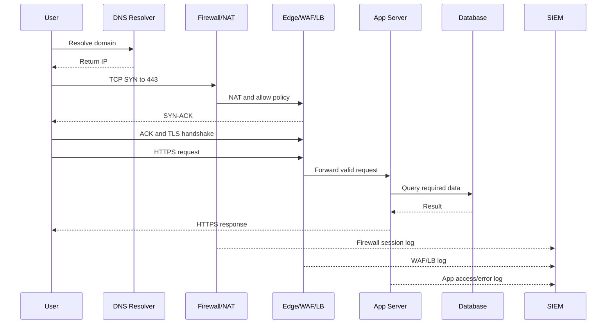
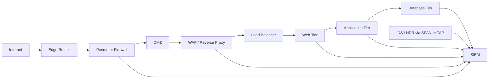
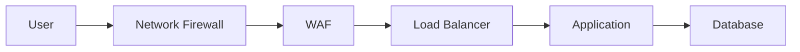

# Networking and Data Center Architecture

## TCP

TCP is a reliable, connection-oriented transport protocol. It provides ordered delivery using sequence numbers, acknowledgements, retransmission, and connection state.

Manager drill points:

- Three-way handshake: SYN -> SYN-ACK -> ACK.
- Graceful close: FIN/ACK exchange.
- Abort/reset: RST.
- Flags: SYN, ACK, FIN, RST, PSH, URG.
- Source port is usually ephemeral; destination port usually indicates service.
- TCP scan evidence: many SYNs to many ports, SYN without completion, RST behavior.
- SYN flood: many half-open connections can exhaust server resources.

SOC answer:

> In a firewall or PCAP, I would check TCP flags, connection state, source/destination IP, source/destination port, action, byte count, and whether a full session was established. A SYN-only pattern across many ports may indicate scanning, while a successful connection followed by data transfer needs deeper investigation.

## UDP

UDP is connectionless. It provides a datagram mode with minimal protocol mechanism. Delivery, ordering, and duplicate protection are not guaranteed.

Manager drill points:

- Used for DNS, DHCP, NTP, SNMP, VoIP, streaming, and some VPN/QUIC traffic.
- Faster because there is no handshake, but less reliable.
- DNS often uses UDP for normal queries and TCP for zone transfers or large responses.
- UDP is abused for amplification/reflection attacks and DNS tunneling.

SOC answer:

> With UDP, I cannot rely on handshake state. I would inspect volume, destination, payload/protocol, query names, response sizes, and whether traffic is going to approved infrastructure. High-volume DNS to random subdomains may indicate DGA, tunneling, or C2.

## Public IP, private IP, and NAT

RFC 1918 private ranges:

- 10.0.0.0/8
- 172.16.0.0/12
- 192.168.0.0/16

Private IP addresses are used inside enterprise networks and are not directly routable on the public Internet. Public IP addresses are globally routable and assigned through registries/ISPs/cloud providers.

NAT translates private IPs to public IPs. PAT maps multiple internal hosts to one public IP using port mappings.

Manager trap:

> If the log shows 192.168.1.10 as source, can you check it in VirusTotal?

Best answer:

> I would not treat that as a public threat intel lookup because it is a private address. I would map it internally using DHCP, EDR, asset inventory, VPN, or firewall NAT logs to identify the hostname/user. If the destination is public, I would enrich the public destination IP/domain.

## Browser-to-website flow

Talk track:

> The browser first resolves the domain using DNS. Then it reaches the gateway, usually through ARP on the local network and routing/NAT beyond it. For HTTPS, TCP establishes the connection, TLS encrypts the session, then HTTP requests pass through controls such as firewall, WAF, reverse proxy, and load balancer before reaching the application and database. For SOC, I would look at DNS, firewall, WAF, proxy, app, database, and endpoint logs.

## Data center architecture

Must explain:

- Edge router connects the data center to external networks.
- Firewall enforces allowed traffic by policy.
- DMZ hosts public-facing services without exposing internal database systems.
- WAF inspects HTTP/S payloads for application attacks.
- Load balancer distributes requests and supports availability.
- Web/app/database tiers are segmented.
- Logs from all tiers feed SIEM for correlation.

## North-south vs east-west

North-south:

- Traffic entering or leaving the data center or cloud boundary.
- Examples: user to web app, server to Internet, API to external provider.
- Controls: edge firewall, WAF, proxy, DDoS protection.

East-west:

- Internal system-to-system traffic.
- Examples: web server to app server, app server to database, workstation to file server.
- Controls: segmentation, internal firewall, EDR, NDR, identity logs.

Interview answer:

> North-south traffic is important for initial access and exfiltration. East-west traffic is important after compromise because attackers move laterally from one host to another. A strong SOC watches both.

## WAF placement

Typical placement:

Why:

- Firewall decides whether traffic can reach the web service.
- WAF inspects allowed HTTP/S for SQLi, XSS, SSRF-like patterns, bad bots, and protocol anomalies.
- Load balancer distributes clean traffic to app servers.

Good line:

> A firewall can allow port 443 correctly, but a SQL injection payload can still be inside that allowed request. That is why WAF and secure coding are both needed.

## Data center security topics they may ask

- HA vs DR.
- Active-active vs active-passive failover.
- Backup vs replication.
- DMZ vs internal network.
- VLAN vs subnet.
- ACL vs firewall rule.
- Reverse proxy vs forward proxy.
- Load balancer vs reverse proxy.
- CDN vs WAF.
- IDS vs IPS placement.
- What logs go to SIEM and why.
- How to secure database access.
- How to monitor east-west movement.

